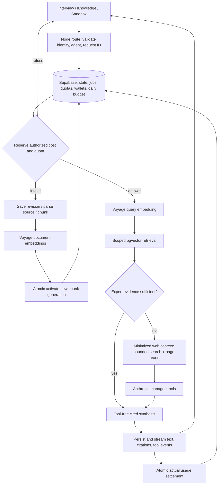

# Phase 2: Interview-First Agent Building — Research

**Researched:** 2026-09-26 · **Confidence:** HIGH on verified APIs and existing code; MEDIUM on recommended integration design. [VERIFIED: session research]

<user_constraints>
## User Constraints (from CONTEXT.md)

The following decisions, discretion, and deferred ideas are copied verbatim. [VERIFIED: 02-CONTEXT.md]

### Interview
- **D-01:** After opening questions, follow one thread deeply through examples, reasoning, and exceptions before switching topics. For vague answers, keep asking focused follow-ups until there is a concrete example or the expert skips.
- **D-02:** The expert can pause and resume, edit any captured answer, and later add a linked follow-up without losing the original response.
- **D-03:** Once the interview has useful examples and working principles, suggest moving to persona and testing; the expert can keep interviewing.

### Persona
- **D-04:** Draft supported persona fields as the interview unfolds; leave unsupported fields blank. Later answers update untouched fields automatically. Preserve expert edits and show new suggestions for those fields.
- **D-05:** Write concise, polished copy faithful to the expert's meaning. Do not invent claims or credentials.
- **D-06:** If the expert edits the Advanced prompt, keep it marked as custom after form changes. Regenerate from the form only on explicit request. Platform safety rules remain outside the editable prompt.

### Knowledge and sandbox
- **D-07:** Use separate interview-answer and document sections on one Knowledge page. Answers show their source question and edit controls; documents show status, page and chunk counts.
- **D-08:** Before processing an upload or pasted text, show remaining source limits and approximate credit cost, then ask the expert to confirm. Settle the actual charge afterward under the existing wallet rules.
- **D-09:** Each sandbox answer has a collapsed Retrieved sources control with excerpts, source names, question or page, and relevance scores.
- **D-10:** If expert material is insufficient, web search is the answer fallback in both sandbox and hirer chat. Cite expert and online sources separately when both contribute, and state which part the expert's material did not cover. Do not present online findings as the expert's own views or add them to the agent's knowledge.
- **D-11:** Show expandable search and page-read steps in chat as they happen, including the search query, page title, and link. Keep the answer's external citations distinct from interview and document citations.

### Planner's discretion
- Choose interview readiness heuristics, source limits, and cost-estimate method while preserving the behaviors above. If web search yields no usable evidence, give a clear uncertainty response rather than inventing an answer.

## Deferred Ideas

None. Online fallback was explicitly brought into this phase rather than deferred.
</user_constraints>

## Project Constraints (from AGENTS.md)

- Read the installed `node_modules/next/dist/docs/` guides before implementation; preserve its generated agent-rules block. Relevant route-handler, route-context, server/client-boundary, and `after` guides were read for this research. [VERIFIED: AGENTS.md; installed Next docs]
- Use `$gsd-phase --edit` for roadmap edits; read with `gsd-sdk query roadmap.get-phase`/`roadmap.analyze`; mark requirements with `requirements.mark-complete`. Neither command group alone nor `phase edit` is a supported substitute. [VERIFIED: supplied AGENTS.md instructions]
- Preserve approved UI-SPEC, existing dark tokens, section routes, and add-only `components/ui/`. No authentication, RLS, real payments, new AI framework, Python service, or deployment requirement. Current context overrides older CONTRIBUTING/STACK references to RLS, Stripe, Vercel, and expert-only refusal. [VERIFIED: PROJECT.md; Phase 1/2 CONTEXT.md; 02-UI-SPEC.md]
- Keep provider/database calls in server modules and route handlers, route all metered calls through `lib/llm/`, use timestamped migrations and generated database types, and coordinate shared-contract changes across affected lanes. No project-local skill directories or graph were found in the inspected paths. [VERIFIED: CONTRIBUTING.md; ROADMAP.md; filesystem discovery]

## Summary

Build the backend foundation first, then separate Knowledge and Runtime work against shared contracts. The frontend currently reads seeds plus `bx-demo-v1` browser deltas; there is no active backend. Its canned retrieval manufactures evidence for empty agents, its prompt enforces the superseded expert-only policy, and its wallet only prechecks an estimate without durable reservation. Archived SQL is a starting reference, not a migration ready to restore. [VERIFIED: lib/demo-store.ts; features/knowledge/search.ts; features/runtime/agent.ts; features/builder/prompt-template.ts; Phase 1 drafts]

Use the approved Next/Supabase/AI SDK/Anthropic/Voyage stack. Current provider docs confirm the model names; correct cache prices and replace whole-credit minimum rounding with exact fractional-credit accounting for raw build cost. Recommend provider-managed web search/fetch in a separate, minimized web context followed by tool-free synthesis; keep all source provenance, tool events, charges, and retries durable. These are implementation recommendations derived from D-01–D-11, not new product decisions. [VERIFIED: 02-CONTEXT.md; features/billing/pricing.ts] [CITED: https://platform.claude.com/docs/en/about-claude/pricing]

**Primary recommendation:** freeze persistence, billing, revision, citation, and stream contracts before parallel UI/Knowledge/Runtime tasks; implement and test offline adapters first, then require a real-service walkthrough to pass the phase. [VERIFIED: ROADMAP.md; phase success criteria]

## Architectural Responsibility Map

Recommended ownership follows existing lanes and approved behavior. [VERIFIED: ROADMAP.md; 02-CONTEXT.md]

| Capability | Primary tier | Secondary tier | Responsibility |
|---|---|---|---|
| Draft inputs, dialogs, streaming presentation | Browser | API | Preserve per-agent drafts; display server status/cost |
| Interview control and persona patch merge | API/Backend | Database | Validate model output; persist state/version/field ownership |
| Source parsing, chunking, embedding | API/Backend | Storage/Database | Bound work; stage versions; activate atomically |
| Agent-scoped retrieval | Database | API/Backend | Required server-resolved agent filter; active versions only |
| Sufficiency, bounded web research, synthesis | API/Backend | Anthropic/Voyage | One reusable runtime with explicit provenance |
| Wallet and daily cap | Database | API/Backend | Atomic holds, usage journal, exactly-once financial effects |
| Seeds and read models | Database | Browser | Idempotent seed import; browser becomes cache/draft holder |

<phase_requirements>
## Phase Requirements

Descriptions below follow REQUIREMENTS.md; support columns prescribe implementation. [VERIFIED: REQUIREMENTS.md]

| ID | Required behavior | Research support |
|---|---|---|
| INTV-01 | Adaptive one-question interview, concrete examples | Persist topic/thread state; structured next-question response |
| INTV-02 | Every answer embedded with question and agent | Immutable answer revisions → staged chunks → active version |
| INTV-03 | Pause and resume | Persist pending question and interview status separately from draft text |
| INTV-04 | Review/edit/delete; re-embed/remove chunks | Optimistic version check, tombstone, atomic index activation |
| INTV-05 | Opening questions draft persona | Evidence-linked sparse persona patches, field ownership |
| INTV-06 | Meter each turn at real cost | Per-provider-call journal + shared settlement |
| INTV-07 | Plain-text input supports later transcripts | Domain input is text, independent of composer |
| PERS-01 | Editable short persona with fixed categories | Validated form and field revisions, pending suggestions |
| PERS-02 | Generated prompt and editable Advanced view | Explicit generated/custom mode; safety kept separately |
| PERS-03 | Category assigns model | Server configuration, never client-supplied model |
| DOCS-01 | PDF/DOCX/TXT/MD/paste | Bounded format adapters; preflight and confirmation |
| DOCS-02 | Source status/counts, deletion removes chunks | Durable job status; tombstone filters before blob cleanup |
| DOCS-03 | Page/heading chunks and actual embedding cost | Per-page PDF / semantic DOCX / plain-text adapters + Voyage usage |
| DOCS-04 | Visible enforced file/byte/chunk limits | Transactional quota holds including concurrent jobs |
| RETR-01 | Top-k from one agent across both source types | Exact cosine pgvector query scoped before LIMIT |
| RETR-02 | Source type/name/question/page/heading citations | Immutable citation snapshots linked to source revision |
| RETR-03 | Cross-agent isolation test | Real SQL integration with two agents and adversarial vectors |
| SBOX-01 | Shared hirer pipeline including web, raw cost | `runAnswer` with server-derived mode/pricing |
| SBOX-02 | Retrieved excerpts/scores and live web steps | Durable typed evidence/tool events + existing disclosures |
| CRED-02 | Tokens/model/purpose/latency/cost logs | Journal every attempt, including query embeddings and helper calls |
| CRED-03 | Building charges actual raw cost | Exact monetary units; no per-call minimum credit |
| CRED-05 | Pre-call balance check and top-up | Atomic reservation before provider dispatch |
| CRED-10 | Daily platform spend cap | Shared day budget holds + spent, checked transactionally |
</phase_requirements>

## Standard Stack

Keep installed Next `16.3.6`, React `19.2.8`, Vitest `5.0.2` and pnpm `11.18.0` project pin. New dependencies below were found in official docs/repos, queried via `npm view`, and passed slopcheck. Pin these researched versions for implementation; dates are exact registry publication dates in UTC. [VERIFIED: package.json; npm registry; slopcheck]

| Package | Version / published | Purpose / official discovery |
|---|---|---|
| `ai` | 7.0.116 / 2026-09-25 | Structured output and streams; https://github.com/vercel/ai [VERIFIED: npm registry] |
| `@ai-sdk/anthropic` | 4.0.65 / 2026-09-25 | Claude and provider tools; https://ai-sdk.dev/providers/ai-sdk-providers/anthropic [VERIFIED: npm registry] |
| `@supabase/supabase-js` | 2.117.2 / 2026-09-25 | Server DB RPC and private Storage; https://supabase.com/docs/reference/javascript/introduction [VERIFIED: npm registry] |
| `zod` | 4.6.5 / 2026-09-13 | Input/env/model-output schemas; https://zod.dev/ [VERIFIED: npm registry] |
| `pdfjs-dist` | 6.3.289 / 2026-08-29 | PDF page text; https://github.com/mozilla/pdf.js [VERIFIED: npm registry] |
| `mammoth` | 1.13.0 / 2026-09-26 | DOCX paragraphs/headings; https://github.com/mwilliamson/mammoth.js [VERIFIED: npm registry] |

```bash
pnpm add -E ai@7.0.116 @ai-sdk/anthropic@4.0.65 @supabase/supabase-js@2.117.2 zod@4.6.5 pdfjs-dist@6.3.289 mammoth@1.13.0
```

Use built-in server `fetch` for Voyage's documented REST embedding endpoint; no additional embedding SDK is needed. Configure `voyage-4-lite`, `output_dimension: 1024`, `input_type: document|query`, `truncation: false`; bill response `usage.total_tokens`. Its context is 32,000 tokens and published standard price is $0.02/MTok. [CITED: https://docs.voyageai.com/reference/embeddings-api] [CITED: https://docs.voyageai.com/docs/embeddings] [CITED: https://docs.voyageai.com/docs/pricing]

| Model | Input / output USD per MTok | Cache read / 5m write USD per MTok |
|---|---|---|
| `claude-sonnet-5` (approved default) | 2 / 10 | 0.20 / 2.50 |
| `claude-haiku-4-5` (configured utility) | 1 / 5 | 0.10 / 1.25 |
| `claude-opus-5-5` (configured quality) | 4 / 20 | 0.20 / 5 |

These IDs and prices are current primary-doc facts; actual account access remains untested. Existing Sonnet/Haiku cache prices are half the documented rate. Include cache writes, cache reads, all steps, embeddings, and successful web searches ($0.01 each); web fetch has no additional tool fee but content consumes tokens. Persist a price-version snapshot per call. [CITED: https://platform.claude.com/docs/en/models/overview] [CITED: https://platform.claude.com/docs/en/about-claude/pricing] [CITED: https://platform.claude.com/docs/en/agents-and-tools/tool-use/web-search-tool] [CITED: https://platform.claude.com/docs/en/agents-and-tools/tool-use/web-fetch-tool]

## Package Legitimacy Audit

Installed slopcheck rejects the protocol's `install --json` flag. Its documented read-only `scan /tmp/phase2-package-audit/package.json --json` succeeded for all six packages; no installation occurred. Registry postinstall fields were absent for all six. [VERIFIED: slopcheck help/results; npm view scripts.postinstall]

| Package | Registry creation | Source repository | Verdict | Disposition |
|---|---|---|---|---|
| ai | 2014-02-21 | vercel/ai | OK | Approved |
| @ai-sdk/anthropic | 2024-04-12 | vercel/ai | OK | Approved |
| @supabase/supabase-js | 2020-01-17 | supabase/supabase-js | OK | Approved |
| zod | 2020-03-07 | colinhacks/zod | OK | Approved |
| pdfjs-dist | 2014-09-22 | mozilla/pdf.js | OK | Approved |
| mammoth | 2013-05-06 | mwilliamson/mammoth.js | OK | Approved |

All registry entries are npm; package age follows creation dates, not the age of this version. Downloads were not returned by this checker and were not independently measured. Removed: none. Suspicious: none. [VERIFIED: npm registry time/repository metadata; slopcheck results]

## Architecture Patterns

### System data flow

Recommended structure derived from the requirements; dashed boundaries are conceptual services. [VERIFIED: 02-CONTEXT.md; ROADMAP.md]



### Component responsibilities

Proposed files extend existing lane boundaries. [VERIFIED: existing features/; ROADMAP.md]

| Module | Responsibility |
|---|---|
| `lib/server/`, `lib/llm/` | Env validation, service-role client, metered Anthropic/Voyage adapters, usage normalization |
| `features/billing/` | Price snapshots, reserve/settle/reconcile API backed by SQL RPC |
| `features/builder/` | Interview controller, persona field merge, generated/custom prompt |
| `features/knowledge/` | Format adapters, source jobs, version activation, scoped retrieval |
| `features/runtime/` | `runAnswer`, sufficiency, web adapter, prompt policy, event serialization |
| `app/api/` | Thin Node runtime handlers; await dynamic `params`; validate all payloads |
| `lib/demo-store.ts`, `components/app/` | Preserve selectors/UI; replace authoritative mutations with API calls |
| `supabase/migrations/`, seed script | Durable schema/RPC and idempotent demo bootstrap |

### 1. Persistence bridge and stable identifiers

Seed existing identities, agents, profiles, history and wallet opening balances idempotently. Current runtime IDs use prefixes and shortened UUIDs; archived schema uses UUID columns. Preserve externally visible IDs with text primary keys or define one explicit stable mapping—do not blindly insert these values into UUID columns. Keep browser storage only for selected identity and per-agent unsent drafts; fetch server read models for wallet/persona/knowledge/history. Explicitly label legacy canned history and never feed it to live retrieval as evidence without real indexing. [VERIFIED: lib/demo-store.ts uid/load/selectors; lib/data/seed.ts; archived core schema]

Recommendation: offer an explicit one-time legacy draft import for edited profiles/personas/answers using idempotent import IDs; never import client ledger deltas as real financial history. Keep old storage until import succeeds. The existing Reset demo control must reset presentation fixtures without deleting real provider spend, usage, or the daily cap. Make unavailable backend configuration visible; never silently resume canned paid actions. [VERIFIED: lib/demo-store.ts resetDemo; archived demo_reset; CRED-02/10]

### 2. Durable wallet and daily cap

Use SQL RPC transactions with row locks, never a sequence of independent REST writes. PostgreSQL `FOR UPDATE` serializes competing writes; Supabase exposes database functions through RPC. Lock order must be consistent (day budget, wallet, operation/reservation); keep network calls outside transactions. [CITED: https://www.postgresql.org/docs/current/explicit-locking.html] [CITED: https://supabase.com/docs/guides/database/functions]

Recommended invariants, derived from the locked no-overdraft/raw-cost rules: [VERIFIED: Phase 1 D-10; CRED-02/03/05/10]

1. Store money as integer nanodollars (`1 credit = 10,000,000 nanodollars`) or exact fixed-scale NUMERIC; do not use floating-point balances or round each embedding to one credit. Round only display values; preserve exact usage and ledger totals.
2. One operation ID per submitted user action; one attempt ID per provider dispatch. Unique idempotency keys cover reservation, usage entry, settlement, mock grants, and source activation. Retried HTTP delivery returns the same operation/result.
3. Atomically reserve wallet funds and a platform-wide UTC-day budget hold, validating `balance - reserved >= hold` and `spent + held + hold <= cap`. Include active reservations from all processes/identities. Document UTC reset time in UI.
4. A typical-cost estimate alone cannot guarantee actual payment and nonnegative balance. Bound inputs/outputs/tool calls and reserve the corresponding maximum envelope, or reserve each next stage before dispatch. The displayed approximate cost and held maximum should remain distinct. Expand holds transactionally before additional work; refuse further stages if expansion fails.
5. Settle actual provider usage, debit exactly once, write ledger and usage, release only that operation's unused hold, and adjust day spent/held in one transaction. Never take funds held by another operation. Archived `least(actual, balance)` violates this invariant.
6. Journal `prepared → dispatched → completed/failed/unknown → settled`; persist provider request IDs and partial usage. Disconnects and timeouts do not prove zero provider cost. Unknown dispatch outcomes keep a reconciliation hold; do not automatically refund/reissue paid requests. Disable hidden SDK retries or account for each actual attempt.
7. A recovery command/job reconciles unfinished operations after process restart. It may release definitely undispatched holds; ambiguous calls need recorded operator reconciliation rather than invented usage. `after()` is bounded background work, not a durable transaction queue. [CITED: https://nextjs.org/docs/app/api-reference/functions/after]

### 3. Interview and persona revision protocol (D-01–D-07)

Persist interview status, current question, active topic, skipped question IDs and a structured summary. Save the expert's answer before a provider call so failure cannot lose it. Return one validated next question, evidence-linked persona suggestions, and readiness reasons; combine these in one structured call where practical. Keep questions and answer text separate; embed question + answer with metadata pointing to the answer revision. Long answers may produce multiple chunks with the same parent. [VERIFIED: INTV-01–07; D-01–05]

Use immutable answer revisions with `current_revision` and `indexed_revision`. Editing stages replacement chunks; switch the active revision only after all embeddings succeed. A stale worker must compare the expected revision before activation. Failure leaves prior active chunks and exposes Retry; deletion tombstones immediately and prevents all pending jobs from reactivating. Linked detail records reference the original answer without overwriting it. Preserve original question/transcript on deletion as approved by UI copy. [VERIFIED: 02-UI-SPEC.md Answer processing/Source lifecycle; D-02/07]

For each persona field store value, provenance answer IDs, `origin: blank|interview|expert`, field version, and pending suggestion. Apply suggestions only to untouched fields at the version the model saw; otherwise retain them for review. The client must also protect unsaved typing. Recompute suggestions after edits/deletes; flag unsupported existing expert text for review without silently deleting it. `prompt_mode: generated|custom` is independent of form version; only explicit confirmed regeneration exits custom mode. Platform instructions are always added separately and never editable. [VERIFIED: D-04–06; 02-UI-SPEC.md]

Recommended initial readiness rule under delegated discretion: at least two concrete examples, one working principle, and one exception, with evidence IDs; show a dismissible suggestion, never a gate. Keep this configurable and evaluate with representative interviews; it is a product heuristic, not a proven quality threshold. [VERIFIED: D-03; Planner's discretion]

### 4. Bounded source intake (D-07–D-08)

Recommended configurable demo limits: 10 document/paste sources per agent, 5 MiB per file, 25 MiB total, 100 PDF pages, 100,000 extracted characters per source, 1,000 active chunks per agent (interview chunks included), 2,000-character target chunks with paragraph boundaries and 200-character overlap. These are planner-selected limits under D-08 discretion, not provider limits. For uploads, confirmation precedes parsing/embedding; quota preflight can inspect MIME/signature/byte size without claiming unknown page/chunk counts. Bind confirmation to content hash, estimate version and expiry; changed cost/limits require reconfirmation. [VERIFIED: D-08; 02-UI-SPEC.md Intake]

Use a private Storage bucket and random object names scoped by agent/source. Reserve file/byte quota at confirmation and chunk quota after parsing; count concurrent reservations. Persist source/job state with attempts, lease, progress and errors. Run a bounded job batch synchronously or via a durable lease consumer; restart/retry resumes recorded work rather than fire-and-forget recursion. Delete/tombstone in DB before asynchronous blob cleanup. [VERIFIED: DOCS-02–04; UI-SPEC lifecycle] [CITED: https://supabase.com/docs/guides/storage/uploads/standard-uploads]

| Format | Recommended extraction and metadata |
|---|---|
| PDF | PDF.js `getDocument` → `getPage` → `getTextContent`; preserve actual page number; plain text only, no execution of document scripts. Validate Node import/worker packaging with fixtures. [CITED: https://mozilla.github.io/pdf.js/examples/] |
| DOCX | Mammoth semantic headings/paragraphs; plain-text output with heading markers via style mapping, never render its HTML. `extractRawText` loses formatting, so do not claim it preserves headings or pages. [CITED: https://github.com/mwilliamson/mammoth.js] |
| TXT / pasted text | Decode bounded UTF-8 and reject empty/binary data; source name plus paragraph indices, page null. [VERIFIED: DOCS-01/03; UI-SPEC] |
| MD | Treat as text, preserve ATX/setext heading paths; never evaluate MDX or embedded HTML. [VERIFIED: DOCS-01/03; UI-SPEC] |

Reject encrypted/unreadable or image-only PDFs with actionable text and paste alternative; do not claim OCR support. Run parsers in a terminable worker with input/output and time limits; compressed DOCX requires decompression/resource limits, not only compressed byte checks. Empty extraction must fail without embedding fabricated text. [VERIFIED: DOCS-03; D-05] [CITED: https://github.com/mwilliamson/mammoth.js]

### 5. Retrieval, sufficiency and web provenance (D-09–D-11)

Use `vector(1024)` and start with exact cosine search plus a B-tree agent filter. pgvector documents exact search by default and recall tradeoffs for ANN; small capped corpora do not require an HNSW decision now. SQL must join active source/answer revisions and filter `agent_id` inside the query before ordering/LIMIT. Bind all parameters; constrain `k`. Scores are relevance, never calibrated confidence. [CITED: https://github.com/pgvector/pgvector]

Remove fabricated chunks and fixed minimum scores. A no-result retrieval is empty; embedding/database failure is a typed error, not fabricated evidence. Run a bounded structured evidence-sufficiency step checking question coverage and evidence IDs. Low similarity alone is not sufficient to decide coverage. Missing subquestions become the explicit knowledge-gap note and a minimal public search query. Do not send interview chunks, custom prompts, private documents, or full chat history into the tool-enabled web request. [VERIFIED: current search.ts; D-09–11]

Use provider-managed `webSearch_20250305` for direct search and current `webFetch_20260318` for reads, avoiding additional search vendors and app-side URL fetching. Start with one search and at most two page reads per answer; enable fetch citations, preserve full tool results, set output/time/content budgets, and stop on bounded continuations. These bounds are recommended implementation defaults. Search/fetch tool errors may arrive inside otherwise successful provider responses; preserve partial evidence and failed steps. [CITED: https://raw.githubusercontent.com/vercel/ai/main/content/providers/01-ai-sdk-providers/05-anthropic.mdx] [CITED: https://platform.claude.com/docs/en/agents-and-tools/tool-use/web-search-tool]

Fetch safeguards are not a hard spend ceiling: `max_content_tokens` is approximate and does not bound PDF binary input. Provider fetch restricts prior-context URLs/private addresses, but explicitly documents residual exfiltration risk. Keep web context minimized, domain policy configurable, and reserve enough for the bounded request's actual possible context—not merely the nominal 4k fetch target. If that envelope does not fit, refuse the web stage before dispatch. [CITED: https://platform.claude.com/docs/en/agents-and-tools/tool-use/web-fetch-tool]

Synthesize with tools disabled, separate expert/web evidence namespaces, and immutable platform rules above editable persona instructions. Validate referenced IDs against evidence returned for this operation; never fabricate external URLs. Persist citation snapshots (excerpt/title/URL/question/page/heading/revision), retrieval scores, specific gap, and chronological tool events with stable IDs/status/sequence. Deleted evidence remains labeled historically but never returns from current retrieval. Online sources never create source/chunk records. [VERIFIED: D-06/09–11; UI-SPEC Evidence/Source lifecycle]

Preserve the existing NDJSON contract behind a provider adapter; extend with `operation-start`, `tool-start`, `tool-update`, `tool-result`, `knowledge-gap`, typed external citations, cap/configuration refusals, and settled/pending cost. Consume SDK `fullStream`, not only text deltas; translate provider tool inputs/results as they arrive and persist the same events before `done`. Tool IDs must match started/completed/error rows. A reload reads persisted history; browser disconnect does not own financial settlement. [VERIFIED: features/runtime/agent.ts current contract] [CITED: https://raw.githubusercontent.com/vercel/ai/main/content/docs/07-reference/01-ai-sdk-core/02-stream-text.mdx]

## Don't Hand-Roll

| Problem | Use instead | Reason/source |
|---|---|---|
| Wallet lock or spend counter in memory | PostgreSQL transaction/RPC | Cross-process concurrency and rollback. [CITED: https://www.postgresql.org/docs/current/explicit-locking.html] |
| Model JSON parsing and provider SSE | AI SDK structured output/stream adapter plus Zod | Typed boundaries; keep custom app events thin. [CITED: https://github.com/vercel/ai] |
| PDF/DOCX decoding | PDF.js/Mammoth | Real format parsers; bound and validate their output. [CITED: https://github.com/mozilla/pdf.js] [CITED: https://github.com/mwilliamson/mammoth.js] |
| Arbitrary-URL crawler | Anthropic managed search/fetch | Existing citation/tool protocol; minimized web context still required. [CITED: https://platform.claude.com/docs/en/agents-and-tools/tool-use/web-fetch-tool] |
| Vector math across client-visible corpora | Scoped pgvector query | Isolation enforced in the only live retrieval path. [VERIFIED: RETR-03] |

## Runtime State Inventory

This phase migrates the frontend-only state boundary. [VERIFIED: STATE.md]

| Category | Items found | Required action |
|---|---|---|
| Stored data | `bx-demo-v1` localStorage plus static seed arrays; actual browser contents not inspected. [VERIFIED: demo-store.ts] | Idempotent server seed; optional explicit legacy draft import; never trust client money |
| Live service config | No env-backed Supabase project available in this checkout/session. Remote settings unverified. [VERIFIED: names-only env audit] | Execution setup checkpoint for DB/Storage/keys; verify model/search access |
| OS-registered state | No app-specific registration identified in repo; Docker daemon unavailable. No machine-wide registry audit performed. [VERIFIED: rg discovery; docker info] | No rename task; start/provision actual DB environment |
| Secrets/env vars | `.env.example` only; required process variables and `.env.local` absent. [VERIFIED: names-only audit] | Add documented server-only settings; never print values |
| Build artifacts/packages | Existing `node_modules`; new server packages absent from package.json; archived unused migrations. [VERIFIED: package.json; filesystem] | Install pinned dependencies; fresh migration/type generation; rebuild |

## Common Pitfalls

- **Overcharging “raw cost”:** current `toChargeCents` rounds any nonzero call to one credit. Replace financial representation, then update billing tests; query embedding and helper calls also count. [VERIFIED: pricing.ts; CRED-03]
- **Restoring archived SQL blindly:** integer money, settlement capped at total balance, no atomic daily cap, no request idempotency, and reset deleting usage all need redesign. [VERIFIED: archived wallet.sql]
- **Success shown before knowledge is live:** keep captured and indexed revisions distinct; race an edit/delete against a slow worker in tests. [VERIFIED: UI-SPEC Answer processing]
- **Persona user text overwritten:** field revisions and provenance must exist in storage and client merge logic, not just prompt instructions. [VERIFIED: D-04/06]
- **Offline fixture becomes live evidence:** seed source displays must not cause retrieval to invent chunks; missing service configuration blocks metered work clearly. [VERIFIED: search.ts; phase success criteria]
- **Tool UI waits for the final answer:** stream tool-input/start events and result updates, including failures; persist replayable ordered steps. [VERIFIED: D-11]
- **Secrets exposed despite no-auth scope:** keep service-role calls server-only, revoke anon/public database/RPC access, validate selected seeded identity and agent ownership server-side. The switcher is a demo selector, not an authentication boundary. [VERIFIED: PROJECT.md; RETR-03]

## Code Examples

Illustrative provider-boundary pattern; surrounding metering/event persistence is deliberately omitted, not optional. AI SDK 7 uses `instructions`; its stream reference marks `system` deprecated. [CITED: https://raw.githubusercontent.com/vercel/ai/main/content/docs/07-reference/01-ai-sdk-core/02-stream-text.mdx]

```ts
import { streamText } from 'ai';
import { anthropic } from '@ai-sdk/anthropic';

const run = streamText({
  model: anthropic('claude-sonnet-5'),
  instructions: platformWebInstructions,
  prompt: publicGapQuery, // no private expert context
  maxOutputTokens: 1200,
  maxRetries: 0,
  abortSignal,
  tools: {
    web_search: anthropic.tools.webSearch_20250305({ maxUses: 1 }),
    web_fetch: anthropic.tools.webFetch_20260318({
      maxUses: 2,
      maxContentTokens: 4000,
      citations: { enabled: true },
      responseInclusion: 'full',
    }),
  },
});
for await (const event of run.fullStream) await persistAndEmit(event);
// Normalize completed-step usage and provider tool usage once; settle by operation ID.
```

This SQL sketch shows the required filter placement; adapt identifiers to the agreed schema and use a service-only RPC. [CITED: https://github.com/pgvector/pgvector] [VERIFIED: RETR-01–03]

```sql
select c.id, c.content, 1 - (c.embedding <=> p_query) as score
from chunks c
join sources s on s.id = c.source_id and s.agent_id = c.agent_id
where c.agent_id = p_agent
  and s.deleted_at is null
  and c.revision_id = s.active_revision_id
order by c.embedding <=> p_query
limit least(greatest(p_k, 1), 12);
```

## State of the Art

| Existing/older approach | Phase 2 approach | Evidence |
|---|---|---|
| AI SDK `system` snippets | Use current `instructions`; pin compatible provider version | Current official stream reference [CITED: https://raw.githubusercontent.com/vercel/ai/main/content/docs/07-reference/01-ai-sdk-core/02-stream-text.mdx] |
| Old expert-only prompt | Sufficiency branch + explicit online provenance | Approved scope change [VERIFIED: 02-CONTEXT.md] |
| Automatic browser financial mutations | Transactional DB-backed operations | Phase 2 real usage requirement [VERIFIED: CRED-02/03/10] |
| Unversioned answer/chunks | Captured/current versus indexed/active revisions | Approved retry behavior [VERIFIED: 02-UI-SPEC.md] |

## Environment Availability

Names-only probes were used; no credentials were printed. [VERIFIED: session shell probes]

| Dependency | Availability | Version / action |
|---|---|---|
| Node / npm | Available | 26.8.2 / 11.19.1; project requires Node >=22 |
| Next / test framework | Installed | 16.3.6 / Vitest 5.0.2 |
| Supabase CLI | Available | 2.90.0 |
| Docker runtime | Not running | CLI exists; daemon connection failed |
| Supabase DB + Storage | Unconfigured | No URL/service-role env; use actual hosted project or start local Supabase |
| Anthropic / Voyage | Unconfigured | Required API keys absent; no paid smoke call performed |
| Context7 | Unavailable | No MCP tool or `ctx7` CLI; used official docs/repositories |
| slopcheck | Available | Read-only scan passed all proposed packages |

**Execution blocker:** real integration needs a reachable Supabase instance, its server credentials, Anthropic/Voyage keys, and enabled search. Finish implementation, offline tests, setup scripts, and configuration diagnostics before the setup checkpoint. Offline test doubles verify behavior only; they cannot satisfy the real-service acceptance gate. [VERIFIED: environment audit; phase success criteria]

## Verification Guidance

Nyquist-specific Validation Architecture is intentionally omitted because `workflow.nyquist_validation` is false. Existing tests use Vitest's Node environment and `**/*.test.ts`; run `pnpm test`, `pnpm lint`, `pnpm typecheck`, then `pnpm build`. [VERIFIED: .planning/config.json; package.json; vitest.config.mts]

Required meaningful coverage: [VERIFIED: phase requirements; D-01–D-11; UI-SPEC]

- SQL integration: concurrent reserves against one wallet and one day cap, settlement replay, simultaneous top-ups, orphan recovery, exact fractional costs, day rollover, reset preserving real spend, agent A/B isolation, revoked public RPC access.
- Interview/index: adaptive follow-up fixtures, pause/reload, skip, answer saved after provider failure, edit/edit and edit/delete races, retry without duplicate active chunks, linked details, persona ownership and custom prompt preservation.
- Intake: supported formats with real page/heading fixtures, malformed/encrypted/image-only PDF, compressed oversized DOCX, empty text, quota races, stale confirmation, failed batch retry and delete during processing.
- Runtime: sufficient expert-only, partial gap, no expert sources, empty/failed search, failed page with another usable source, fake citation rejection, tool start before completion, tool replay after reload, interruption/unknown usage, prompt injection and no expert-private-text leakage into web queries.
- Live gate: build a fresh agent through typed interview → edit answer → confirm source upload → sandbox cited answer → web fallback → inspect actual usage/ledger and database isolation. Preserve approved UI states and keyboard/mobile behavior in the walkthrough.

## Security Domain

Security enforcement is enabled by default because no disabling key exists. Use ASVS **5.0** names below; older template mappings such as “V2 Authentication” are obsolete for this version. This is a scoped control map, not a certification claim. [VERIFIED: .planning/config.json] [CITED: https://github.com/OWASP/ASVS/tree/master/5.0/en]

| ASVS category | Applies | Phase control |
|---|---|---|
| V1 Encoding/Sanitization, V2 Validation/Business Logic | Yes | Zod schemas, text-only evidence rendering, quota/money invariants |
| V3 Web Frontend, V4 API/Web Service | Yes | Same-origin mutations, bounded bodies, safe links, typed error responses |
| V5 File Handling | Yes | Signature/type/size validation, private objects, bounded parser worker |
| V6 Authentication, V7 Sessions | Deferred by scope | Do not add sign-in; document demo identity limitations |
| V8 Authorization | Yes for data scope | Server agent/owner resolution; scoped retrieval; DB privileges |
| V11 Cryptography, V12 Communication | Provider/platform facilities | TLS to providers; standard crypto IDs/hashes, no custom crypto |
| V13 Configuration, V14 Data Protection, V16 Logging | Yes | Server-only keys, minimal web context, redacted logs, durable usage |

Recommended threat controls: tampering via custom prompts → immutable platform layer and validated evidence IDs; information disclosure via tools → isolated minimized web request; denial of service via parsers/tool loops → resource bounds and budget holds; repudiation/duplicate charges → immutable attempt journal and idempotent ledger; cross-agent leakage → SQL filter and integration test. [VERIFIED: D-06/10/11; RETR-03; CRED-02/10] [CITED: https://platform.claude.com/docs/en/agents-and-tools/tool-use/web-fetch-tool]

## Assumptions Log

No unsupported factual claim is promoted into a locked decision. Numeric limits/readiness/budget configuration above are explicit recommendations within approved planner discretion, not empirically verified performance claims. Provider entitlement, parser compatibility in this build, and live settlement remain execution checks. [VERIFIED: 02-CONTEXT.md Planner's discretion; environment audit]

## Open Questions

1. **Provider account pricing:** Voyage documents a free token allowance; standard-rate computed usage and actual cash invoice can differ. Keep gross usage and effective billed cost separate; document configured allowance/discount policy before claiming invoice-exact settlement. No account entitlement was available to inspect. [CITED: https://docs.voyageai.com/docs/pricing]
2. **Ambiguous provider completion:** process loss after dispatch can leave unknown billable usage. Implement persisted reconciliation state and operator tooling; do not claim exactly-once remote execution. [VERIFIED: proposed operation protocol; absence of live access]
3. **Web budget envelope:** fetch content limits are approximate and exclude binary PDF bounds. Validate worst-case reservation/configuration with real responses; insufficient budget must fail closed before further calls. [CITED: https://platform.claude.com/docs/en/agents-and-tools/tool-use/web-fetch-tool]

## Sources

Primary sources were inspected 2026-09-26; official live docs do not all publish a revision date. Registry publication dates are recorded above. Context7 was unavailable and the official-doc fallback was used. [VERIFIED: session tools]

- Installed Next route-handler, route-context, server/client and `after` guides; current app files and archived migrations — local behavior and migration risks. [VERIFIED: filesystem reads]
- [AI SDK source/reference](https://github.com/vercel/ai), [Anthropic provider](https://ai-sdk.dev/providers/ai-sdk-providers/anthropic) — provider names, tools, current stream API.
- [Claude models](https://platform.claude.com/docs/en/models/overview), [pricing](https://platform.claude.com/docs/en/about-claude/pricing), [search](https://platform.claude.com/docs/en/agents-and-tools/tool-use/web-search-tool), [fetch](https://platform.claude.com/docs/en/agents-and-tools/tool-use/web-fetch-tool) — service capabilities and cost.
- [Voyage embeddings](https://docs.voyageai.com/docs/embeddings), [REST](https://docs.voyageai.com/reference/embeddings-api), [pricing](https://docs.voyageai.com/docs/pricing) — dimensions, input modes, usage and price.
- [Supabase functions](https://supabase.com/docs/guides/database/functions), [Postgres locking](https://www.postgresql.org/docs/current/explicit-locking.html), [pgvector](https://github.com/pgvector/pgvector) — transactions and scoped retrieval.
- [PDF.js](https://github.com/mozilla/pdf.js), [Mammoth](https://github.com/mwilliamson/mammoth.js), [ASVS 5.0](https://github.com/OWASP/ASVS/tree/master/5.0/en) — parsing and security boundaries.

## Metadata

**Stack confidence:** HIGH — official sources, npm version/date/postinstall queries and slopcheck passed. **Architecture confidence:** MEDIUM — grounded in repo/contracts, not yet exercised against configured services. **Pitfalls confidence:** HIGH for identified code defects and documented provider limitations. **Valid until:** recheck APIs/prices in 7 days or before installation; retain locked product decisions. [VERIFIED: evidence above]
