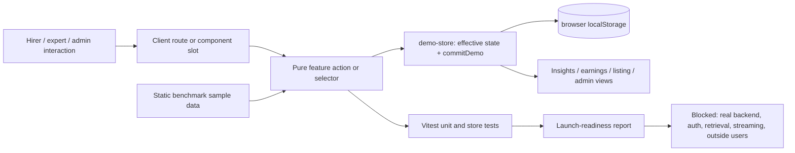

# Phase 4: Trust, Insights & Launch Readiness - Research

**Researched:** 2026-09-27  
**Domain:** local-first trust controls, expert insights, demo economics, and launch-readiness validation  
**Confidence:** MEDIUM

<user_constraints>
## User Constraints (from CONTEXT.md)

### Locked Decisions

### Working in parallel
- **D-01:** All Phase 4 work happens on branch `trust/phase-4-trust-insights-launch-readiness`, never on `main`. Merge through small PRs.
- **D-02:** Build on the Phase 1 localStorage demo store (`lib/demo-store.ts`). Phase 2 will bring a real backend later, so put Phase 4 logic in `features/` modules with plain typed functions (e.g. `features/trust/`, `features/insights/`, `features/benchmark/`, a new file under `features/billing/` for cash-out) and keep `setState` calls thin, so porting is cheap.
- **D-03:** Additions to shared files (`lib/types.ts`, `lib/demo-store.ts`, `lib/data/seed.ts`) are additive only: new types, new optional `DemoState` collections, no renames. Existing saved browser state must keep loading. Missing new collections default to empty or seed values rather than wiping state or bumping `STORAGE_KEY`. Land these additions as the first, smallest plan so other lanes can rebase on them.
- **D-04:** Do not change the frozen Phase 1 contracts (`searchKnowledge`, `personaToSystemPrompt`, `buildPrompt`, wallet check, settlement math in `features/billing/pricing.ts`, chat stream types).
- **D-05:** `components/app/chat.tsx`, `components/app/marketplace.tsx` and `app/(app)/agents/[slug]/page.tsx` are also being edited by the Phase 3 owners. Keep Phase 4 edits there minimal and slot-shaped (render a Phase 4 component in one place) so merges stay easy.
- **D-06 [informational]:** Do not commit edits to `.planning/STATE.md` or `.planning/ROADMAP.md` from this branch; a single coordinator owns them. Proposed `REQUIREMENTS.md` additions (MKT-V2-03 moved to v1, BENCH-01) need coordinator sign-off. Plans reference the IDs anyway.

### Ratings and written reviews (MKT-05 + MKT-V2-03)
- **D-07:** Hirer rates 1–5 stars with an optional written comment, once per agent per identity, unlocked after 5+ messages sent to that agent across the hirer's conversations. The listing shows the average, the count, and a reviews list (stars, comment, reviewer name, relative date). Update `Agent.ratingAvg`/`ratingCount` so marketplace sorting keeps working. Seed a handful of reviews per published agent so listings look lived-in (placeholder content per Phase 1 D-03).

### Feedback, sharing, flags, admin (CHAT-08, CHAT-09, MKT-06, ADMN-01)
- **D-08:** Thumbs up/down on every assistant answer (the icons already render in `CostCaption`; make them toggle `Message.feedback`). Transcript sharing is a per-conversation toggle in the chat view, off by default (`Conversation.shareTranscript` already exists). Anyone can flag an agent from its listing or a conversation from chat, with a reason; flags go to the `/admin` queue (`Flag` type exists). The admin can see open flags for agents and conversations, resolve them, and unpublish an agent with a required note. Unpublished agents disappear from the marketplace.

### Expert insights and money (EXPT-01, EXPT-02, CRED-08, CRED-09)
- **D-09:** `/insights` shows aggregates for each agent: conversations, messages, top questions asked, and thumbs-down count. It also shows only the transcripts hirers opted to share. `/earnings` shows gross, platform share and net per conversation, plus a full wallet history. Mock cash-out debits credits and records a payout at 1¢ per credit with status "requested" (replacing the current toast), writing a `cashout` ledger row.

### Benchmark (new, BENCH-01)
- **D-10:** Benchmark compares **our expert agents** against **other AI agents: Muse, Grok, and Hermes**. It is framed as coming from our internal benchmark suite built on popular open-source agent benchmarks with real traction online (for example τ²-bench, GAIA, SWE-bench Verified, BFCL, Terminal-Bench). The planner may pick the set to name.
- **D-11:** Scored dimensions: **cost** (per task), **efficiency** (tokens/steps per task), **speed** (latency / time to answer), **build time** (time to create a working agent), and **tool use / task success**. The team changed the criteria: agents now have tool use and can pull from GitHub. This is not yet reflected in REQUIREMENTS.md, whose Out of Scope table still lists "agent tools". An overall score may combine the dimensions.
- **D-12:** Placement: (a) a **Benchmark tab on each agent's listing page** comparing that agent with Muse, Grok and Hermes; (b) a **score badge on marketplace cards**; (c) a global **`/benchmarks` page** in the sidebar ranking our agents against the generic agents. Charts follow the Phase 1 visual system.
- **D-13:** Numbers are hand-picked sample data that makes our agents look strong. This is a hackathon demo about the idea; the user accepted that the numbers are not measured. Keep them in one data file (e.g. `lib/data/benchmarks.ts`) and show a small "Sample data" label on benchmark views, matching the team's rule to label preloaded demo data (docs/BUILDFEST-STRATEGY.md).

### Acceptance gates (success criteria 4 and 5)
- **D-14:** Plan the adversarial fixtures (cross-tenant access, transcript privacy, citation validity, weak-retrieval refusal, regulated-category safety, streaming errors) and a ledger reconciliation unit test now, against the demo store. Mark the full outside-user run and real-data checks as blocked on Phases 2–3; do not fake them as passed.

### the agent's Discretion
- Exact layout of the review form, flag dialog, admin queue and benchmark charts, within 01-UI-SPEC.md.
- Which named open-source benchmarks to cite, the overall-score formula, and the sample values.
- Module and file names under `features/`.

### Deferred Ideas (OUT OF SCOPE)
- Running the benchmark for real against the competitor agents (live harness, measured numbers)
- Moderating individual review text from the admin queue
- **CHAT-06** (fixed emergency/self-harm resource reply + auto-flag): moved into Phase 4 on `main` by Phase 3, deferred out of this plan set by the user on 2026-09-26 during plan-phase source audit. Adversarial fixture RS-03 stays marked blocked. Coordinator to confirm where it lands (e.g. Phase 4.1). Open inputs: resource list (988 / 911 / UW UHS proposed) and an exception to D-03/D-05 for a guard at the top of `sendChatMessage`.
- Updating REQUIREMENTS.md (MKT-V2-03 → v1, BENCH-01, tool use / GitHub removed from Out of Scope): coordinator's call
</user_constraints>

## Project Constraints (from AGENTS.md)

- Before modifying Next.js code, read the relevant installed guide under `node_modules/next/dist/docs/`; this repository uses a Next.js version with breaking changes. [VERIFIED: AGENTS.md:1-16]
- Preserve the generated Next.js agent-rules block when it appears in a diff because `next dev` recreates it. [VERIFIED: AGENTS.md:1-16]

<phase_requirements>
## Phase Requirements

| ID | Description | Research Support |
|---|---|---|
| MKT-05 | Hirer can rate an agent from 1 to 5 stars after five or more messages, once per agent; the listing shows the average and count. | Keep eligibility, validation, aggregate calculation, and persistence in `features/trust/reviews.ts`; mount the UI in one listing slot. |
| MKT-06 | Anyone can flag an agent from its listing or chat; flags go to an admin queue. | Reuse the completed chat flag module and component; listing only mounts its existing flag slot. |
| CHAT-06 | Messages matching emergency or self-harm patterns get a fixed resource reply instead of an agent answer, and the conversation is flagged. | Explicitly deferred by the locked context; keep RS-03 blocked and require coordinator scope confirmation before a separate plan. |
| CHAT-08 | Hirer can thumbs up or down any answer. | Implemented in 04-02; preserve it for insights aggregation and launch fixtures. |
| CHAT-09 | Hirer can opt in, per conversation, to share the transcript with the expert; the default is off. | Implemented in 04-02; insights must consume only this effective field. |
| CRED-08 | Expert sees an earnings page: per-conversation gross, platform share, and net credited, plus a wallet history of every debit and credit. | Derive view rows from existing ledger entries in a pure billing selector and render the whole ledger. |
| CRED-09 | Expert can request a mock cash-out that deducts credits and records a payout row at 1 cent per credit with status "requested". | Cash-out domain logic and tests exist; add the dialog/page integration and retain its revalidation. |
| EXPT-01 | Expert sees aggregates for each agent: conversations, messages, top questions asked, thumbs-down count. | Use a pure insights selector over effective conversations/messages, then render per owned agent. |
| EXPT-02 | Expert can read the transcripts that hirers opted to share, and only those. | Filter effective conversations by owner and `shareTranscript`; never fetch or render unshared transcript text. |
| ADMN-01 | Admin can see flagged agents and flagged conversations and unpublish an agent with a note. | Implemented in 04-02; leave the queue transcript-free and reuse it in the outside-user runbook. |
</phase_requirements>

## Summary

Phase 4 remains a local-first presentation build. The recommended plan completes the unimplemented expert, benchmark, listing-review, and launch-fixture surfaces on top of the already completed additive store, trust, and moderation controls. Put calculations and permission checks in typed `features/` functions, then give each existing route a small client component slot. [VERIFIED: .planning/phases/04-trust-insights-launch-readiness/04-03-PLAN.md:1-185] [VERIFIED: .planning/phases/04-trust-insights-launch-readiness/04-04-PLAN.md:1-133] [VERIFIED: .planning/phases/04-trust-insights-launch-readiness/04-05-PLAN.md:1-103]

The implementation cannot provide genuine cross-user confidentiality or an administrator authorization boundary while identity and transcripts live in one browser's localStorage. Treat the Phase 4 checks as demo-state guards, document that limit in launch readiness, and keep any full privacy, cross-tenant, real-retrieval, real-streaming, and outside-user acceptance checks explicitly blocked on the Phase 2/3 backend work. [VERIFIED: .planning/phases/04-trust-insights-launch-readiness/04-CONTEXT.md:13-13] [CITED: https://nextjs.org/docs/app/getting-started/server-and-client-components]

**Primary recommendation:** Complete 04-03 through 04-06 in their current dependency order, with pure selectors/actions tested in Vitest before the corresponding route or component slot is changed. [VERIFIED: .planning/phases/04-trust-insights-launch-readiness/04-03-PLAN.md:1-185] [VERIFIED: .planning/phases/04-trust-insights-launch-readiness/04-04-PLAN.md:1-133] [VERIFIED: .planning/phases/04-trust-insights-launch-readiness/04-05-PLAN.md:1-103] [VERIFIED: .planning/phases/04-trust-insights-launch-readiness/04-06-PLAN.md:1-147]

## Architectural Responsibility Map

| Capability | Primary Tier | Secondary Tier | Rationale |
|---|---|---|---|
| Review eligibility, write-once review, rating aggregate | Browser / Client | API / Backend (future) | The local demo store owns current state; the pure function boundary makes a future server transaction replace the store write. [VERIFIED: .planning/phases/04-trust-insights-launch-readiness/04-CONTEXT.md:18-20] |
| Feedback, transcript-sharing, flags, moderation queue | Browser / Client | API / Backend (future) | Current UI and local store implement the interaction; production access control must move to the backend. [CITED: https://nextjs.org/docs/app/getting-started/server-and-client-components] |
| Earnings, cash-out, and reconciliation | Browser / Client | API / Backend (future) | Ledger/payout selection is deterministic local computation today; any real money operation requires a server authority. [VERIFIED: features/billing/cashout.ts:1-88] |
| Expert insights and shared-transcript view | Browser / Client | API / Backend (future) | The selector filters local conversation state now; backend authorization must later enforce the same policy. [VERIFIED: lib/types.ts:101-112] |
| Benchmark leaderboard and badges | Browser / Client | CDN / Static | Hand-picked sample data is static demo content and belongs in one data file consumed by client views. [VERIFIED: .planning/phases/04-trust-insights-launch-readiness/04-CONTEXT.md:59-65] |
| Adversarial fixtures and ledger reconciliation | Build / Test | Browser / Client | They verify domain modules and the demo-state seam without creating a user-facing trust boundary. [VERIFIED: .planning/phases/04-trust-insights-launch-readiness/04-06-PLAN.md:1-147] |

## Standard Stack

### Core

| Library | Version | Purpose | Why Standard |
|---|---:|---|---|
| Next.js | `16.3.6` | App Router routes and interactive presentation UI | Existing project framework; interactive/localStorage-driven controls belong behind Client Component boundaries. [VERIFIED: package.json:18-18] [CITED: https://nextjs.org/docs/app/api-reference/directives/use-client] |
| React / React DOM | `19.2.8` | Component state and event handling | Existing rendering runtime used by the route and component surfaces. [VERIFIED: package.json:21-22] |
| TypeScript | `^5` | Typed domain contracts and selectors | Existing strict project type-checking baseline. [VERIFIED: package.json:10-10] [VERIFIED: package.json:38-38] |
| Vitest | `^5.0.2` | Unit tests for feature modules and store-level actions | Existing test runner supports `.test.ts` discovery and one-shot `vitest run`. [VERIFIED: package.json:11-11] [VERIFIED: package.json:39-39] [CITED: https://vitest.dev/guide/] |

### Supporting

| Library | Version | Purpose | When to Use |
|---|---:|---|---|
| `lucide-react` | `^1.48.0` | Existing icon set | Use for new navigation, feedback, review, and benchmark icons only. [VERIFIED: package.json:16-16] |
| `sonner` | `^2.0.8` | Existing transient feedback | Use after a locally persisted user action, never as the sole record of a cash-out or moderation result. [VERIFIED: package.json:24-24] |

### Alternatives Considered

| Instead of | Could Use | Tradeoff |
|---|---|---|
| Existing local demo-store seam | Backend database/auth service | Deferred by locked D-02; introducing it here would violate the phase boundary and make parallel work harder to merge. [VERIFIED: .planning/phases/04-trust-insights-launch-readiness/04-CONTEXT.md:17-20] |
| Static benchmark sample data | Live benchmark harness | Deferred by locked D-13; measured competitor claims are out of scope. [VERIFIED: .planning/phases/04-trust-insights-launch-readiness/04-CONTEXT.md:41-41] |

**Installation:** No package installation is planned. Use the repository's existing dependencies. [VERIFIED: package.json:13-40]

Manifest excerpts: `"next": "16.3.6"`, `"react": "19.2.8"`, `"react-dom": "19.2.8"`, `"vitest": "^5.0.2"`, `"packageManager": "pnpm@11.18.0"`, and `"node": ">=22"`. [VERIFIED: package.json:18-22] [VERIFIED: package.json:39-43]

## Architecture Patterns

### System Architecture Diagram



The planner should keep the route as the client interaction boundary and keep authorization, validation, aggregation, and state transformation in a typed feature module. Next.js documents Client Components as the boundary for state, event handlers, and browser APIs, while server components are the later home for secrets and database access. [CITED: https://nextjs.org/docs/app/getting-started/server-and-client-components]

### Recommended Project Structure

```text
features/
├── billing/       # cash-out, earnings selectors, reconciliation
├── benchmark/     # deterministic score calculation
├── insights/      # owner-scoped aggregates and transcript selector
├── launch/        # fixture catalogue and meta tests
└── trust/         # reviews plus existing feedback, flags, moderation
components/
├── earnings/      # cash-out dialog
├── insights/      # shared transcript presentation
├── benchmark/     # leaderboard, card badge, agent panel
└── trust/         # review and listing-slot components
lib/data/          # single benchmark sample-data source
app/(app)/         # thin route composition only
```

### Pattern 1: Plan then apply through the local-store seam

**What:** A pure function validates and creates the next records; one small action reads current state, revalidates inside `commitDemo`, then applies the plan. [VERIFIED: features/billing/cashout.ts:25-88]

**When to use:** Review creation, cash-out requests, and any state mutation where stale browser state or a second click must be rejected consistently. [VERIFIED: features/billing/cashout.ts:77-87]

**Example:**

```ts
// Source: features/billing/cashout.ts:77-87
export function requestCashout(credits: number): CashoutResult {
  const identityId = currentIdentity(readDemo()).id;
  const now = new Date().toISOString();
  let result = planCashout(readDemo(), identityId, credits, now);
  if (!result.ok) return result;
  commitDemo((s) => {
    const current = planCashout(s, identityId, credits, now);
    result = current;
    return current.ok ? applyCashout(s, current) : s;
  });
  return result;
}
```

### Pattern 2: Compute effective state before every read

**What:** UI selectors must read the effective collections rather than raw seed arrays or raw state, because Phase 4 uses additive overlays for edits. [VERIFIED: lib/demo-store.ts:231-281]

**When to use:** Insights, review aggregates, admin queues, listing rating summaries, and transcript filtering. [VERIFIED: lib/demo-store.ts:231-281]

**Example:**

```ts
// Source: lib/demo-store.ts:253-261
export function allReviews(s: DemoState): Review[] {
  return [...REVIEWS, ...(s.reviews ?? [])];
}

export function reviewsFor(s: DemoState, agentId: string): Review[] {
  return allReviews(s)
    .filter((review) => review.agentId === agentId)
    .sort((a, b) => b.createdAt.localeCompare(a.createdAt));
}
```

### Pattern 3: Slot-shaped integration into shared Phase 3 files

**What:** Build a self-contained Phase 4 component and render it once from the listing, chat, marketplace, or sidebar surface that is shared with other work. [VERIFIED: .planning/phases/04-trust-insights-launch-readiness/04-CONTEXT.md:21-22]

**When to use:** The review/benchmark/agent-flag listing block and benchmark badge/sidebar link. [VERIFIED: .planning/phases/04-trust-insights-launch-readiness/04-04-PLAN.md:84-133] [VERIFIED: .planning/phases/04-trust-insights-launch-readiness/04-05-PLAN.md:67-103]

### Anti-Patterns to Avoid

- **Putting domain rules in JSX event handlers:** it bypasses unit tests and prevents a backend port. Use a pure planner/action pair. [VERIFIED: .planning/phases/04-trust-insights-launch-readiness/04-CONTEXT.md:18-20]
- **Reading raw transcript collections for insights:** it can reveal a conversation after sharing is withdrawn. Filter effective conversations by the current sharing field. [VERIFIED: lib/types.ts:101-112]
- **Duplicating benchmark values across views:** it will let listing badges, agent tabs, and the global ranking disagree. Use the one locked data file. [VERIFIED: .planning/phases/04-trust-insights-launch-readiness/04-CONTEXT.md:41-41]
- **Treating local role switching as authorization:** it is a demo affordance, not a security boundary. Keep the limitation visible in the runbook. [ASSUMED]

## Don't Hand-Roll

| Problem | Don't Build | Use Instead | Why |
|---|---|---|---|
| State persistence and backward compatibility | A second localStorage key or an independent state store | The existing optional `DemoState` collections, normalization, selectors, and `commitDemo` seam | D-03 requires old saved state to load without a key bump. [VERIFIED: .planning/phases/04-trust-insights-launch-readiness/04-CONTEXT.md:18-19] |
| Mutation consistency | Unchecked page-level `setState` calls | The existing plan/apply pattern | It allows revalidation immediately before persistence. [VERIFIED: features/billing/cashout.ts:77-87] |
| Test runner/configuration | Ad hoc Node assertion scripts | Existing Vitest configuration and `pnpm test` | The repository explicitly includes `**/*.test.ts` in the node environment. [VERIFIED: vitest.config.mts:5-8] [CITED: https://vitest.dev/guide/] |
| Benchmarking harness | Live competitor calls or fabricated measurement claims | One labelled static sample dataset and deterministic scoring | The locked scope requires hand-picked sample data and defers a live harness. [VERIFIED: .planning/phases/04-trust-insights-launch-readiness/04-CONTEXT.md:41-41] |

**Key insight:** The valuable reusable code here is deterministic domain logic and a narrow persistence seam; interface-specific work should remain a small composition layer. [VERIFIED: .planning/phases/04-trust-insights-launch-readiness/04-CONTEXT.md:18-20]

## Common Pitfalls

### Pitfall 1: Counting the wrong messages for review eligibility

**What goes wrong:** A review unlocks based on one conversation, assistant messages, or a seeded review rather than the hirer's user messages across conversations for the same agent. [VERIFIED: .planning/phases/04-trust-insights-launch-readiness/04-CONTEXT.md:28-29]

**How to avoid:** Make one selector filter effective conversations by `hirerId` and `agentId`, count only user-authored messages in those conversations, and test boundary counts of four and five. [ASSUMED]

### Pitfall 2: Leaking an unshared transcript through insights or moderation

**What goes wrong:** A raw conversation or message lookup appears in an expert view after the hirer has not opted in or has turned sharing back off. [VERIFIED: lib/types.ts:101-112]

**How to avoid:** The insights selector must first scope agents to the current expert, then include only effective conversations where `shareTranscript` is true; admin rows retain metadata only and never transcript text. [VERIFIED: .planning/phases/04-trust-insights-launch-readiness/04-02-PLAN.md:1-198]

### Pitfall 3: Cash-out debits more than earned credits

**What goes wrong:** A cash-out is bounded only by the wallet balance and lets seed credits or a duplicate request become a payout. [VERIFIED: features/billing/cashout.ts:13-70]

**How to avoid:** Retain `availableCents` as the lower of balance and net earned credits, reject non-integers/non-positive amounts, and replan inside the commit callback. [VERIFIED: features/billing/cashout.ts:13-87]

### Pitfall 4: Benchmark claims look measured

**What goes wrong:** A sample score is rendered without an in-context label or different views use different data/formulas. [VERIFIED: .planning/phases/04-trust-insights-launch-readiness/04-CONTEXT.md:41-41]

**How to avoid:** Keep data in one file, calculate scores in one pure module with exact unit tests, and show “Sample data” on every leaderboard, listing tab, and badge. [VERIFIED: .planning/phases/04-trust-insights-launch-readiness/04-04-PLAN.md:1-133]

### Pitfall 5: Claiming blocked launch gates passed

**What goes wrong:** A test suite is reported as evidence of cross-browser access control, real retrieval, streaming failure handling, or outside-user usability. [VERIFIED: .planning/phases/04-trust-insights-launch-readiness/04-CONTEXT.md:13-13] [VERIFIED: .planning/phases/04-trust-insights-launch-readiness/04-CONTEXT.md:44-44]

**How to avoid:** Use executable fixtures for current demo behavior and `it.todo`/runbook rows naming every unavailable dependency. [VERIFIED: .planning/phases/04-trust-insights-launch-readiness/04-06-PLAN.md:72-147]

## State of the Art

| Old Approach | Current Approach | When Changed | Impact |
|---|---|---|---|
| Placeholder toast for cash-out | Tested local cash-out domain action exists; route integration remains | Plan 04-03 is partially in the worktree | Preserve the existing domain action and only add dialog/page composition. [VERIFIED: features/billing/cashout.ts:1-88] |
| Placeholder admin/trust controls | Flag queue, transcript sharing, feedback, and unpublish controls landed in 04-02 | 2026-09-27 | Do not replan those controls; consume their selectors/actions. [VERIFIED: .planning/STATE.md:8-10] |

## Open Questions

1. **CHAT-06 destination**
   - What we know: It remains an explicit Phase 4 requirement in `REQUIREMENTS.md`, while the locked context defers it out of this plan set. [VERIFIED: .planning/REQUIREMENTS.md:73-76] [VERIFIED: .planning/phases/04-trust-insights-launch-readiness/04-CONTEXT.md:101-107]
   - What's unclear: The resource list and whether the guard may touch the frozen chat path.
   - Recommendation: Keep it out of the replan and keep launch fixture RS-03 blocked until the coordinator chooses a phase and provides the required resource copy.

2. **Benchmark source names and formula**
   - What we know: D-10 through D-13 grant discretion over named benchmarks, score formula, and sample values.
   - What's unclear: Which named benchmark labels best support the final demo narrative.
   - Recommendation: Use a transparent weighted deterministic formula and include only benchmark names that the team can substantiate before demo day. [ASSUMED]

3. **Real privacy and outside-user evidence**
   - What we know: The demo persists state in a browser and the locked acceptance gate waits for Phase 2/3.
   - What's unclear: The actual identity, authorization, and data model that will be available at the final gate.
   - Recommendation: Keep the runbook executable but mark the full run as blocked until those phases provide backend data and real answers. [VERIFIED: .planning/phases/04-trust-insights-launch-readiness/04-CONTEXT.md:13-13]

## Environment Availability

| Dependency | Required By | Available | Version | Fallback |
|---|---|---:|---|---|
| Node.js | Next.js, Vitest, TypeScript | ✓ | `v24.11.1` | — |
| pnpm | repository scripts | ✓ | `11.18.0` | — |
| Browser localStorage | current demo state | ✓ (application architecture) | browser API | No server fallback in this phase. [ASSUMED] |

The manifest declares `"engines": { "node": ">=22" }`; the detected runtime satisfies that present constraint. [VERIFIED: package.json:41-44]

**Missing dependencies with no fallback:** None for the current local demo scope. [ASSUMED]

**Missing dependencies with fallback:** None identified; a real backend, authentication service, model provider, and benchmark harness are deferred scope rather than execution dependencies. [VERIFIED: .planning/phases/04-trust-insights-launch-readiness/04-CONTEXT.md:101-107]

## Existing Test Architecture

Nyquist validation is disabled by `workflow.nyquist_validation: false`, so a required Nyquist Validation Architecture section is intentionally omitted. [VERIFIED: .planning/config.json:20-20]

| Property | Value |
|---|---|
| Framework | Vitest `^5.0.2` in Node environment. [VERIFIED: package.json:39-39] [VERIFIED: vitest.config.mts:5-8] |
| Config file | `vitest.config.mts`; includes `**/*.test.ts` and excludes `node_modules/**`, `.next/**`. [VERIFIED: vitest.config.mts:5-8] |
| Unit command | `pnpm exec vitest run <feature-test-file>` or `pnpm test`. [VERIFIED: package.json:11-11] |
| Type/lint command | `pnpm typecheck && pnpm lint`. [VERIFIED: package.json:9-10] |

| Requirement group | Test type | Planned evidence |
|---|---|---|
| MKT-05 / written reviews | unit + store-level | Four/five-message boundary, one review per `(identity, agent)`, persisted review, recomputed rating. [VERIFIED: .planning/phases/04-trust-insights-launch-readiness/04-05-PLAN.md:1-103] |
| CRED-08 / CRED-09 | unit + store-level | Ledger-derived rows, cash-out input rejection, one ledger row plus matching payout, reload persistence. [VERIFIED: features/billing/cashout.test.ts:9-68] |
| EXPT-01 / EXPT-02 | unit | Owned-agent aggregate and shared-only transcript filters. [VERIFIED: .planning/phases/04-trust-insights-launch-readiness/04-03-PLAN.md:122-185] |
| BENCH-01 | unit | Scoring formula and single sample-data source. [VERIFIED: .planning/phases/04-trust-insights-launch-readiness/04-04-PLAN.md:1-133] |
| Launch criteria | unit + manual-blocked | Reconciliation tamper cases, fixture coverage meta-tests, explicit blocked `it.todo` cases, and runbook. [VERIFIED: .planning/phases/04-trust-insights-launch-readiness/04-06-PLAN.md:1-147] |

## Security Domain

`workflow.security_enforcement` is enabled at ASVS level `1` with a `high` blocking threshold. [VERIFIED: .planning/config.json:20-20] [VERIFIED: gsd-tools config query, 2026-09-27]

### Applicable ASVS Categories

| ASVS Category | Applies | Standard Control |
|---|---|---|
| V2 Authentication | Deferred | No authentication exists in the browser demo; record this as a launch limitation and move identity enforcement to the future backend. [ASSUMED] |
| V3 Session Management | Deferred | No session is present; do not represent identity switching as a session boundary. [ASSUMED] |
| V4 Access Control | Yes | Pure permission checks limit UI/store actions today; server-side ownership checks are required before production. [CITED: https://owasp.org/projects/asvs] |
| V5 Validation, Sanitization and Encoding | Yes | Validate star range, message count, flag reason/detail length, cash-out amount, and unpublish note before the write action. [CITED: https://owasp.org/projects/asvs] |
| V6 Cryptography | No new control | The phase adds no cryptographic operation; use platform/server controls when real sensitive persistence is introduced. [ASSUMED] |
| V8 Data Protection | Yes | Render an expert transcript only after the explicit sharing filter and retain no transcript in admin queue rows. [CITED: https://owasp.org/projects/asvs] |
| V11 Business Logic | Yes | Enforce one review, review eligibility, payout cap, write-once/resolve moderation state, and reconciliation tests. [CITED: https://owasp.org/projects/asvs] |

### Known Threat Patterns for this stack

| Pattern | STRIDE | Standard Mitigation |
|---|---|---|
| Browser identity switch exposes another local record | Elevation of privilege / Information disclosure | Treat as a demo limitation; use the current permission helpers for UI behavior and require backend authorization before production. [ASSUMED] |
| Unshared transcript reaches expert or admin screen | Information disclosure | Scope by agent owner then effective `shareTranscript`; test share then unshare; never include transcript body in admin queue rows. [VERIFIED: lib/types.ts:101-112] [VERIFIED: .planning/phases/04-trust-insights-launch-readiness/04-02-PLAN.md:1-198] |
| Repeated review, flag, or cash-out write | Tampering | Validate in pure planner and revalidate within the persistence callback. [VERIFIED: features/billing/cashout.ts:77-87] |
| Hand-picked score appears as measured evidence | Repudiation / Integrity | Label every benchmark presentation as sample data and derive all scores from one static source. [VERIFIED: .planning/phases/04-trust-insights-launch-readiness/04-CONTEXT.md:41-41] |
| Moderation note / review text used as unbounded input | Denial of service / Tampering | Limit and trim inputs in the action, then render as text rather than trusted markup. [ASSUMED] |

## Assumptions Log

| # | Claim | Section | Risk if Wrong |
|---|---|---|---|
| A1 | Local role switching does not provide a production authorization boundary. | Architecture Patterns | A demo control could be presented as real privacy/security. |
| A2 | Review eligibility should count only hirer-authored messages, with four/five as the boundary tests. | Common Pitfalls | The released review rule could diverge from the intended UX. |
| A3 | Browser localStorage is available on the presentation browser. | Environment Availability | The local demo could not persist state. |
| A4 | No current execution dependency is missing for the local demo. | Environment Availability | A plan task might fail on the presentation machine. |
| A5 | The listed local demo security boundaries require backend enforcement before production. | Security Domain | The security posture could be overstated. |
| A6 | A transparent deterministic benchmark formula is sufficient for the sample-data demo. | Open Questions | Demo messaging could need a different product decision. |

## Sources

### Primary (HIGH confidence)

- [Repository `package.json`](../../package.json) — installed framework, scripts, runtime constraint. [VERIFIED: package.json:1-44]
- [Repository demo-state and cash-out modules](../../lib/demo-store.ts) — current persistence/selector seam; [cash-out module](../../features/billing/cashout.ts) — current plan/apply action. [VERIFIED: lib/demo-store.ts:22-281] [VERIFIED: features/billing/cashout.ts:1-88]
- [Phase 4 context](04-CONTEXT.md) — locked scope and deferred ideas. [VERIFIED: .planning/phases/04-trust-insights-launch-readiness/04-CONTEXT.md:1-89]

### Secondary (MEDIUM confidence)

- [Next.js Client Components](https://nextjs.org/docs/app/getting-started/server-and-client-components) — browser API/client boundary.
- [Next.js `use client` directive](https://nextjs.org/docs/app/api-reference/directives/use-client) — interactive component boundary and serializable props.
- [Vitest Guide](https://vitest.dev/guide/) — test naming, one-shot execution, and configuration.
- [OWASP ASVS](https://owasp.org/projects/asvs) — categories for application security verification.

### Tertiary (LOW confidence)

- Assumptions Log entries A1–A6 require confirmation before any production claim.

## Metadata

**Confidence breakdown:**
- Standard stack: HIGH — direct repository manifest and installed local docs establish the current versions and constraints. [VERIFIED: package.json:13-44]
- Architecture: MEDIUM — locked project decisions and current plan/code seams establish the local implementation; future backend placement is intentionally deferred. [VERIFIED: .planning/phases/04-trust-insights-launch-readiness/04-CONTEXT.md:17-22]
- Pitfalls: MEDIUM — derived from locked acceptance criteria and current persistence patterns; production-security limits remain assumptions. [VERIFIED: .planning/phases/04-trust-insights-launch-readiness/04-06-PLAN.md:1-147]

**Research date:** 2026-09-27  
**Valid until:** 2026-10-27 for the repository-local plan; refresh before package or backend scope changes.
