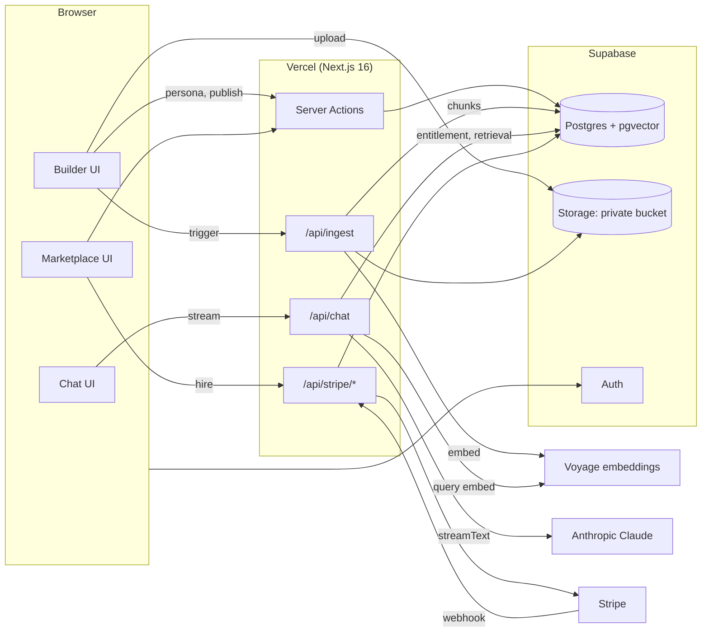

# Architecture

Technical design for the MVP. Optimized for four people shipping a working, presentable loop in four weeks, not for scale. Research behind these choices (with sources) is in [RESEARCH.md](RESEARCH.md#3-tech-stack).

## 1. Stack

One Next.js app. One database. One LLM provider. One deploy.

| Layer | Choice | Why |
|---|---|---|
| Framework | **Next.js 16** (App Router, Turbopack, React 19) | UI + API route handlers in one deploy. Note: `middleware.ts` is now `proxy.ts` in Next 16. |
| UI | **Tailwind v4 + shadcn/ui** | Copy-in components. Zero design debates. Forms, dialogs, tables ready. |
| Language / tooling | TypeScript strict, **pnpm 11** (pinned via `packageManager`) | pnpm 12 is weeks old. Pin 11. |
| Backend | Next.js route handlers + Server Actions | No second service. Same auth context as the UI. |
| Database + vectors | **Supabase Postgres + pgvector** (HNSW) + `tsvector` for hybrid search | One bill, Row-Level Security built in, no separate vector DB. |
| Auth | **Supabase Auth** via `@supabase/ssr` | Cookie sessions work in Server Components and route handlers. RLS uses the same JWT. |
| File storage | **Supabase Storage**, private bucket | Signed uploads from the builder. Server reads for ingestion. |
| LLM | **Anthropic Claude** via `@ai-sdk/anthropic` | Default chat model: `claude-sonnet-5` (fast, cheap, 1M context). Quality option per agent: `claude-opus-5-5`. Utility calls (titles, tagging): `claude-haiku-4-5-20251001`. Prompt caching on. |
| Agent runtime | **Vercel AI SDK 7** (`ai@7`, `streamText`, `ToolLoopAgent`, `useChat`) | Streaming UI for free, native Claude tool calling and structured output. |
| Embeddings | **Voyage AI `voyage-4-lite`** (1024-d) | Anthropic's recommended partner; free allowance covers the whole project. Fallback: OpenAI `text-embedding-3-small`. |
| Document parsing | `unpdf` (PDF), `mammoth` (DOCX), raw MD/TXT, Jina Reader (`r.jina.ai/<url>`) for URLs | Pure JS, no native deps, runs on Vercel. |
| Payments | **Stripe Checkout** (destination charges) + **Stripe Connect Express** for expert payouts | Stripe does KYC and payouts. Platform sets `application_fee_amount`. |
| Hosting | **Vercel** (preview per PR) + Supabase cloud | Streaming works inside Vercel function limits. |
| CI | GitHub Actions: lint + typecheck on PR | Vercel preview is the build check. |

### Rejected (and when to revisit)

| Option | Why not now | Revisit if |
|---|---|---|
| Separate Python/FastAPI service | Second deploy, CORS, JWT forwarding. Every RAG step is a few dozen lines of TS. | A teammate has a Python-only library they truly need. |
| Turborepo / pnpm workspaces | Config overhead for one deployable. Folder ownership gives the same isolation. | We add a second app (mobile, worker). |
| LangGraph JS | Graph abstraction is overkill for single-agent RAG chat. | Agents need multi-step workflows or tools calling tools. |
| Claude Agent SDK | It's the Claude Code harness (filesystem, bash, subprocess). Not a serverless chat persona. | Never for this product. |
| Claude Managed Agents | Built for long-running autonomous sessions with sandboxes. Adds session lifecycle. | "Hire an agent to do a multi-hour task" becomes a feature. |
| Pinecone or other vector DB | Another vendor, no RLS. pgvector handles this scale trivially. | Millions of chunks. |
| Supabase automatic embeddings (pgmq + Edge Functions) | Four extensions and a Deno function. | Ingestion outgrows Vercel's 300 s limit. |
| LlamaParse | Extra vendor. | A demo expert uploads table-heavy or scanned PDFs. |

## 2. System overview



## 3. Repo layout and ownership

One workstream per top-level folder under `features/`. You may edit anything, but changes outside your folder get a review from that folder's owner (see `.github/CODEOWNERS` and [WORKSTREAMS.md](WORKSTREAMS.md)).

```
/
├── .github/                          # CI, templates, CODEOWNERS         → platform
├── docs/                             # this folder                       → platform
├── proxy.ts                          # Supabase session refresh          → platform
├── app/
│   ├── (marketing)/page.tsx          # landing                           → marketplace
│   ├── (auth)/{login,signup}/        # auth pages                        → platform
│   ├── (app)/
│   │   ├── layout.tsx                # app shell, nav                    → platform
│   │   ├── build/                    # "my agents" list                  → builder
│   │   ├── build/[agentId]/
│   │   │   ├── persona/              # persona form                      → builder
│   │   │   ├── knowledge/            # upload + source list              → builder (calls features/knowledge)
│   │   │   ├── test/                 # sandbox chat + sources panel      → builder (calls features/runtime)
│   │   │   └── publish/              # pricing + publish                 → builder
│   │   ├── marketplace/              # browse, filter, search            → marketplace
│   │   ├── agents/[slug]/            # public listing + hire CTA         → marketplace
│   │   ├── chat/[conversationId]/    # hirer chat                        → runtime
│   │   ├── earnings/                 # expert earnings, Connect status   → billing
│   │   └── admin/                    # review queue, metrics (P1)        → platform
│   └── api/
│       ├── ingest/route.ts           # parse → chunk → embed             → knowledge
│       ├── chat/route.ts             # streamText loop                   → runtime
│       └── stripe/
│           ├── checkout/route.ts     # create Checkout session           → billing
│           ├── webhook/route.ts      # checkout.session.completed etc.   → billing
│           └── connect/route.ts      # Express onboarding link           → billing
├── features/
│   ├── builder/                      # persona form, prompt template, publish action
│   ├── knowledge/                    # parsers/, chunk.ts, embed.ts, search.ts
│   ├── runtime/                      # agent.ts, prompt.ts, safety.ts, tools/, message-ui/
│   ├── marketplace/                  # cards, filters, listing queries, ratings
│   └── billing/                      # stripe.ts, entitlements.ts, ledger.ts, webhooks.ts
├── components/ui/                    # shadcn — ADD only, never edit in feature PRs
├── lib/
│   ├── supabase/{client,server,admin}.ts
│   ├── llm/                          # model registry, usage logging, spend cap (all LLM calls go through here)
│   ├── env.ts                        # zod-validated env
│   └── db.types.ts                   # generated by `pnpm db:types`
├── supabase/
│   ├── migrations/                   # timestamped SQL, one per PR
│   ├── seed.sql                      # 3 demo experts
│   └── config.toml
├── scripts/seed.ts                   # uploads demo docs + triggers ingestion
└── .env.example
```

## 4. Data model

All tables have `id uuid pk default gen_random_uuid()`, `created_at`, `updated_at`. RLS is enabled on every table in the same migration that creates it.

| Table | Key columns | RLS summary |
|---|---|---|
| `profiles` | `user_id` (fk auth.users), `display_name`, `avatar_url`, `is_expert`, `headline`, `credentials`, `years_experience`, `contact_url`, `stripe_account_id` | Owner read/write; public read of expert fields when they have a published agent. |
| `agents` | `owner_id`, `slug`, `name`, `category` (enum), `headline`, `description`, `persona jsonb` (form fields), `system_prompt` (generated, editable), `greeting`, `example_questions text[]`, `model`, `free_trial_messages int`, `price_cents int`, `status` (`draft` / `published` / `unpublished`), `rating_avg`, `rating_count`, `usage_count` | Owner full; anyone reads `published`. |
| `sources` | `agent_id`, `kind` (`pdf` / `docx` / `text` / `md` / `url`), `name`, `storage_path`, `status` (`queued` / `processing` / `ready` / `failed`), `error`, `chunk_count`, `bytes` | Owner only. |
| `chunks` | `source_id`, `agent_id`, `position`, `page`, `heading_path`, `content`, `embedding vector(1024)`, `fts tsvector` (generated), `pinned bool` | Owner reads; server (service role) reads for retrieval. Never exposed to hirers directly. |
| `conversations` | `agent_id`, `hirer_id`, `is_sandbox`, `free_messages_used`, `title`, `last_message_at` | Hirer (or owner if sandbox) only. |
| `messages` | `conversation_id`, `role`, `content`, `citations jsonb` (`[{chunk_id, source_name, page}]`), `feedback` (`up` / `down` / null), `tokens_in`, `tokens_out`, `model`, `latency_ms` | Same as conversation. |
| `purchases` | `hirer_id`, `agent_id`, `conversation_id`, `amount_cents`, `stripe_checkout_id` (unique, for idempotency), `status` (`pending` / `paid` / `refunded`), `mode` (`stripe` / `mock`) | Hirer reads own; agent owner reads for their agents. |
| `ledger` | `purchase_id`, `account` (`platform_fee` / `expert_earnings` / `payout`), `expert_id`, `amount_cents` (signed), `stripe_transfer_id` | Expert reads own rows. Append-only. |
| `ratings` | `agent_id`, `hirer_id`, `stars`, `review`, unique `(agent_id, hirer_id)` | Hirer writes own; public read. |
| `llm_usage` | `user_id`, `agent_id`, `purpose`, `model`, `tokens_in`, `tokens_out`, `cost_cents` | Admin only. Drives the daily spend cap. |

Indexes: HNSW `vector_cosine_ops` on `chunks.embedding`, GIN on `chunks.fts`, btree on `(agent_id)` for chunks and sources, `(hirer_id, agent_id)` on purchases.

One Postgres function `hybrid_search(p_agent_id, p_query_text, p_query_embedding, p_k)` implements semantic + full-text with Reciprocal Rank Fusion (copy from Supabase's hybrid-search guide). Pinned chunks are unioned in at the top.

## 5. Key flows

### 5.1 Ingestion

```
Builder uploads file → Storage (signed URL) → insert `sources` (queued)
→ POST /api/ingest {sourceId}
   → service-role client loads file
   → parse by kind (unpdf per-page / mammoth / raw / Jina)
   → chunk: split on headings, then paragraphs; ~800 tokens, ~100 overlap; keep page + heading_path
   → embed in batches of 64 (Voyage, input_type="document")
   → insert chunks, update source → ready, chunk_count
   → for large PDFs: process N pages per request, re-invoke self, stay under Vercel's 300 s
```

Week 1: synchronous with a spinner. Week 2: fire-and-forget with status polling.

### 5.2 Chat

```
POST /api/chat {conversationId, message}
→ auth: getClaims(); load conversation + agent
→ entitlement: canChat(userId, agentId, conversationId)
     sandbox? yes → allow
     free_messages_used < free_trial_messages → allow, increment
     paid purchase for this conversation → allow
     else → 402 {reason: "paywall"}
→ safety pre-check on user message (emergency/self-harm patterns → canned resource reply, stored, return)
→ retrieval: embed query (input_type="query") → hybrid_search(agent_id, k=8)
→ prompt = [system: persona + grounding rules + category disclaimer if first turn]
           + [context: chunks numbered [1]..[n] with source name + page]
           + [history: last N turns]
           + [user message]
   (system prompt kept byte-stable so Anthropic prompt caching hits)
→ streamText(model from agent.model) → toUIMessageStreamResponse()
→ onFinish: persist assistant message with citations parsed from [n] markers,
            log llm_usage, update conversation.last_message_at
```

The sandbox (`build/[agentId]/test`) and the hirer chat (`chat/[conversationId]`) hit the same route. The sandbox additionally receives the retrieved chunks in the stream's data part so the sources panel can render them.

Citations, MVP path: the persona is instructed to cite `[n]` inline. The chat UI turns `[n]` into a hover card showing source name and page. Exact-quote citations via Anthropic's `search_result` blocks are a P1 upgrade and require calling the Anthropic SDK directly for the answer step.

### 5.3 Hire

```
Hirer hits paywall → click "Hire for $X"
  PAYMENTS_MODE=mock:
    server action inserts purchases(status=paid, mode=mock) + 2 ledger rows → unlock
  PAYMENTS_MODE=stripe:
    POST /api/stripe/checkout → Stripe Checkout session (destination charge to expert's connected account,
      application_fee_amount = 20%) → redirect
    webhook checkout.session.completed → verify signature on raw body → upsert purchases by stripe_checkout_id
      (idempotent) → 2 ledger rows (platform_fee, expert_earnings) → unlock
```

Experts without a connected Stripe account (P1) can still be hired in MVP: the charge goes to the platform account and the ledger records what they're owed. Payout is a manual admin action.

## 6. Day-one shared contracts

Write these **before** splitting into workstreams so everyone integrates against the same shapes. The `platform` owner lands them in the first migration and `lib/`; each workstream owner stubs their function on day one.

```ts
// lib/db.types.ts — generated; the schema above is the source of truth

// features/knowledge/search.ts
export type RetrievedChunk = { id: string; sourceName: string; page: number | null; headingPath: string | null; content: string; score: number };
export async function searchKnowledge(agentId: string, query: string, k?: number): Promise<RetrievedChunk[]>;
export async function ingestSource(sourceId: string): Promise<void>;

// features/runtime/agent.ts
export type AgentConfig = { id: string; model: string; systemPrompt: string; greeting: string; category: Category; };
export function buildPrompt(cfg: AgentConfig, chunks: RetrievedChunk[], isFirstTurn: boolean): string;

// features/billing/entitlements.ts
export type Entitlement = { allowed: true; reason: "sandbox" | "trial" | "paid"; trialRemaining?: number } | { allowed: false; reason: "paywall" };
export async function canChat(userId: string, conversationId: string): Promise<Entitlement>;
export async function recordPurchase(input: { hirerId: string; agentId: string; conversationId: string; amountCents: number; mode: "mock" | "stripe"; stripeCheckoutId?: string }): Promise<void>;

// features/builder/prompt-template.ts
export function personaToSystemPrompt(persona: PersonaForm): string;

// lib/llm/index.ts — every LLM call goes through here
export function chatModel(id?: string): LanguageModel;      // wraps @ai-sdk/anthropic, applies usage logging + spend cap
export async function embed(texts: string[], inputType: "document" | "query"): Promise<number[][]>;
```

## 7. Environment

See `.env.example`. Public: Supabase URL + anon/publishable key, Stripe publishable key, app URL. Server-only: Supabase service role (ingest and webhooks only), Anthropic, Voyage, Stripe secret + webhook secret. `PAYMENTS_MODE` and `LLM_DAILY_SPEND_CAP_USD` are the two switches the demo depends on.

## 8. Pitfalls we already know about

1. **Supabase free tier pauses after 7 idle days** and caps at 500 MB DB / 1 GB storage. Upgrade to Pro for demo month or keep it warm.
2. **Next 16 renamed `middleware.ts` to `proxy.ts`.** Using the old name means sessions never refresh.
3. **Authorize with `getClaims()` / `getUser()`, never `getSession()` server-side.** Enable RLS before the first demo. Service-role key only in `api/ingest` and `api/stripe/webhook`.
4. **Vercel functions hard-stop at 300 s (Hobby).** Chunk ingestion per request. Stream every chat response.
5. **Stripe webhooks:** verify signature on `await req.text()`, use `stripe listen` locally, idempotent by `stripe_checkout_id`. Never compute entitlements client-side.
6. **AI SDK 7 is new.** LLM-generated snippets target v4/v5. Use the v7 docs and `Output.object`, not `generateObject`.
7. **Prompt caching needs a byte-stable system prompt.** No timestamps in it. User question goes last.
8. **pgvector:** fix the dimension at 1024 once. Create the HNSW index after the first bulk load. Always pass Voyage `input_type`.
9. **Merge conflicts:** `components/ui` is add-only; migrations are timestamped; one person regenerates `db.types.ts` per migration PR.
10. **Don't** build custom auth, add a second deployable, or store uploads in git. 50 MB per file cap in MVP.
