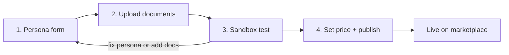
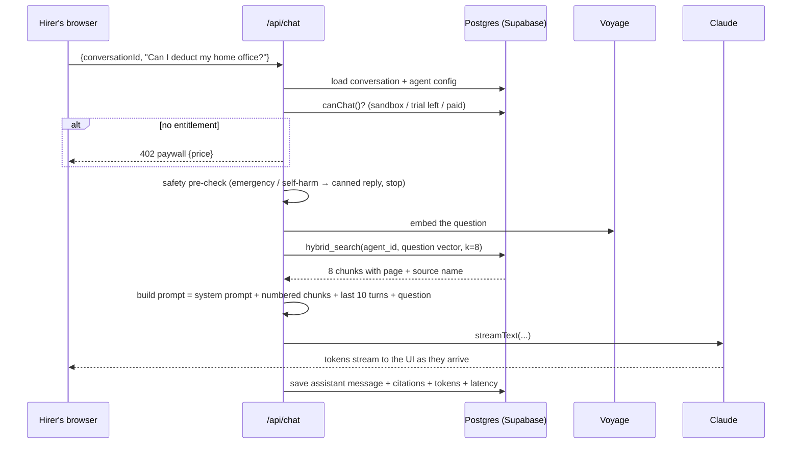
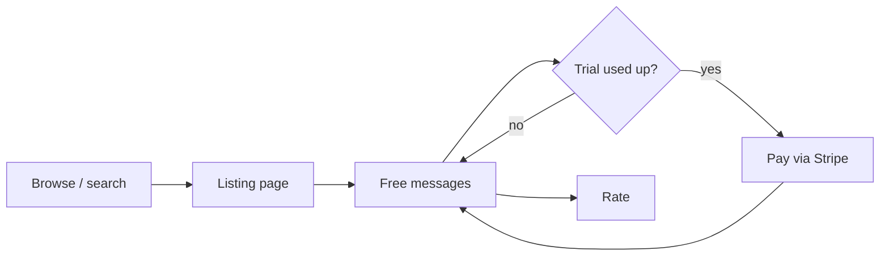

# How an Agent Is Built and Run

Plain-language explanation of the whole thing, end to end, and how it maps to LangSmith / LangGraph. Read this before the [Architecture](ARCHITECTURE.md).

## 1. The one-sentence version

**An agent is a saved configuration (persona + knowledge base + price), and every chat message runs the same fixed pipeline: retrieve the expert's relevant material, hand it to Claude with the persona, stream the answer back with citations.**

Nobody writes code to make an agent. The expert fills in a form and uploads documents. The pipeline is ours and identical for every agent.

## 2. What LangSmith / LangGraph does, and what we borrow

LangChain's stack has two halves. **LangGraph Platform** is the runtime and hosting layer for agents. **LangSmith** is the observability, testing, and prompt-management layer on top. Their primitives are the right mental model, so we use the same words.

| LangGraph / LangSmith concept | What it is there | Our equivalent |
|---|---|---|
| **Assistant** | A saved configuration of a graph: which prompt, which model, which tools. Many assistants can share one graph. | The `agents` row. Persona form → system prompt, chosen model, price. Every agent is one Assistant on our single, fixed graph. |
| **Graph** (nodes + edges) | The developer-authored flow: which steps run in what order, with branching. | One fixed pipeline for every agent (see §4). Not editable by experts in MVP. |
| **Thread** | A persisted conversation with state (message history, checkpoints). | The `conversations` row + its `messages`. |
| **Run** | One invocation of the graph on a thread. | One `POST /api/chat` call. |
| **Store** (long-term memory) | Key-value memory that persists across threads, namespaced by user/assistant. | The `chunks` table: the expert's knowledge, embedded, namespaced by `agent_id`. Same job (give the model things to remember), but ours is filled by document upload, not by the model writing to it. |
| **Tools** | Functions the model can call mid-run. | One tool, `searchKnowledge`, called by our pipeline on every turn rather than left to the model to decide. Model-chosen tools are post-MVP. |
| **LangGraph Studio** | Visual debugger: step through a run, see each node's input/output, edit state and re-run. | The **sandbox** page: chat with your own agent and see, per answer, the exact chunks that were retrieved and their scores. |
| **LangSmith tracing** | Every LLM call logged with prompt, response, tokens, latency. | `llm_usage` + `messages` rows (tokens in/out, model, latency, citations). |
| **LangSmith evals / datasets** | Run a question set against the agent and score outputs. | The 20-question eval set per seed agent, checked for grounded-answer rate and zero hallucinated citations before demo. |
| **Prompt Hub** | Versioned, shared prompt templates. | `features/builder/prompt-template.ts`: one template that turns the persona form into a system prompt. "Advanced" lets the expert edit the compiled result. |
| **LangSmith Agent Builder** (no-code) | Describe the agent in natural language, attach tools/skills, it drafts the config. | Our persona form is the constrained version of this. Post-MVP: "paste your bio and three docs, we draft the persona for you" using structured output. |
| **Deployment / hosted assistants API** | LangGraph Platform hosts the graph and exposes it as an API. | Vercel hosts the Next.js app; the marketplace listing + chat page *is* the hosted endpoint. |

**Why not just use LangGraph?** For a single-agent retrieval chat, the graph abstraction adds a learning curve and no capability we need. If agents later need multi-step tool use or branching workflows, LangGraph JS is the natural upgrade for the runtime layer and the data model above already fits it.

## 3. The expert's workflow (build side)



**Step 1 — Persona form.** Name, category, headline, bio/credentials, "how I work" (tone, what you always ask first), always-do list, never-do list, example questions, greeting. We compile this into a system prompt with a template. The expert never has to see the words "system prompt."

Roughly, the compiled prompt looks like:

```
You are [name], [headline]. [description]
How you work: [how I work]
Always: [always-do list]
Never: [never-do list]
Answer using the numbered reference material below. Cite it inline like [2].
If the material does not cover the question, say so plainly and suggest contacting [name] directly at [contact].
Clearly label anything that is general knowledge rather than [name]'s own material.
```

**Step 2 — Upload documents.** PDF, DOCX, TXT, MD, or pasted text. For each file we:

1. Parse it to text, keeping page numbers (PDF) or headings (DOCX/MD).
2. Split it into chunks of roughly 800 tokens with a small overlap, so each chunk is a self-contained passage.
3. Turn each chunk into an embedding (a vector of 1,024 numbers that captures its meaning) with Voyage AI.
4. Store chunk text + vector + page + heading in the `chunks` table, tagged with this agent's id.

The expert sees each file go *queued → processing → ready*.

**Step 3 — Sandbox test.** The expert chats with their own agent using exactly the production pipeline. A side panel shows which chunks were retrieved for each answer and how well they matched. If an answer is wrong, the expert either edits the persona, uploads a better document, or (P1) writes a correction that becomes a pinned chunk.

**Step 4 — Set price and publish.** Free-trial message count, price per conversation. Publish flips the status to `published` and the listing page goes live.

## 4. What happens on every message (the fixed pipeline)

This is the "graph." It is the same for every agent and every message, whether in the sandbox or from a paying hirer.



In words:

1. **Entitlement.** Is this the expert's sandbox, does the hirer have free messages left, or have they paid for this conversation? If none, return a paywall response and the UI shows the hire button.
2. **Safety.** Cheap pattern check for emergency or self-harm content. If it fires, reply with a resource message and skip the model entirely.
3. **Retrieve.** Embed the question, find the eight most relevant chunks from *this agent's* knowledge only. Pinned corrections always come along.
4. **Assemble.** System prompt (stable, so Anthropic's prompt cache hits), then the chunks numbered `[1]` to `[8]` with their source name and page, then recent history, then the question last.
5. **Generate.** Claude streams the answer. The persona tells it to cite `[n]` inline and to say "I don't have that" when the chunks don't cover the question.
6. **Persist.** Save the message, the citations (which chunk each `[n]` pointed to), tokens, latency. Log usage for the spend cap.

The chat UI turns each `[n]` into a hover card showing the source document and page. That is the whole trust story: every claim points at something the expert actually wrote.

## 5. The hirer's workflow (hire side)



The listing page is generated from the same persona form (headline, description, example questions) plus the expert's profile (credentials, years, photo). Clicking an example question starts a conversation with that question already sent. After the free messages, the chat shows the price and a hire button. Payment unlocks that conversation. Every purchase writes two ledger rows: platform fee and expert earnings. The expert's earnings page sums the ledger.

## 6. Why this is enough for the MVP, and what comes after

**Enough because:** the demo needs an expert to build in minutes, a hirer to get a visibly grounded answer, and money to move. A persona + retrieval pipeline does all three, and it is what GPTs, Gemini Gems, and Delphi-style clones do under the hood for knowledge agents.

**After the MVP,** in rough order of value:

1. **Model-chosen tools** (calculator, web lookup, the expert's own calendar link) — this is where LangGraph JS or AI SDK's `ToolLoopAgent` earns its keep.
2. **Draft-the-persona-for-me** from uploaded docs, using structured output. This is the LangSmith Agent Builder idea.
3. **Exact-quote citations** with Anthropic `search_result` blocks instead of `[n]` markers.
4. **Memory across conversations** for a returning hirer (LangGraph Store proper).
5. **Evals in the builder** so an expert can run their own question set before publishing.
